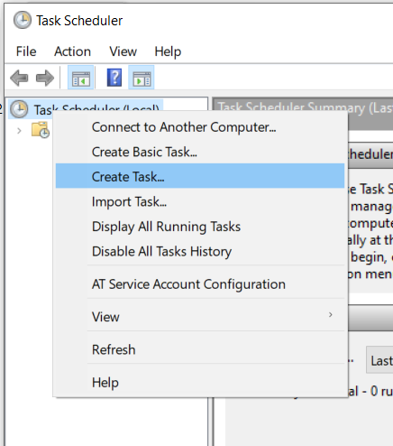
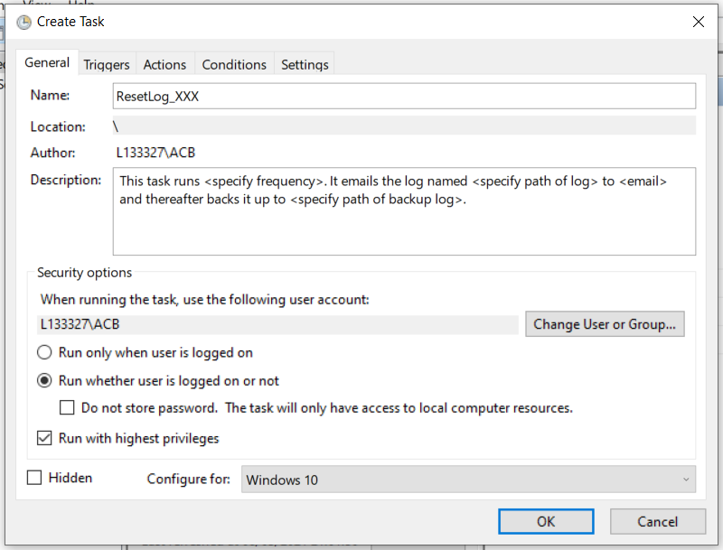
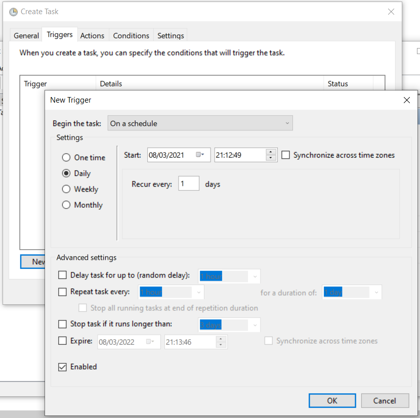
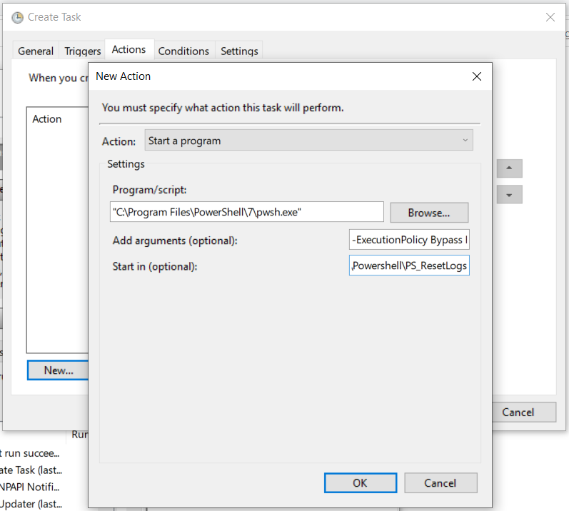
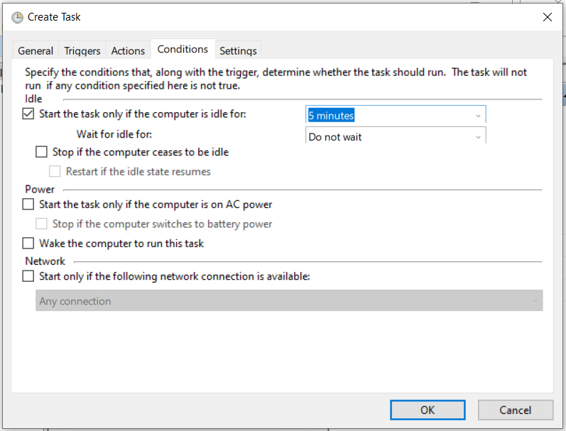
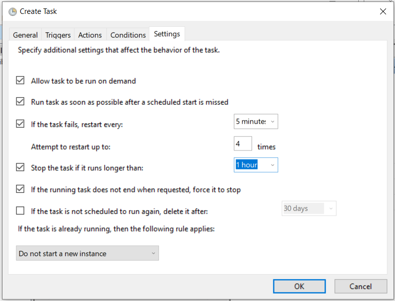
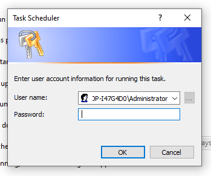

# Reset-Logs

## What is Reset-Logs

Reset-Logs is a small utility that takes a log file (that must not be locked) and,

* [Optionally] Moves it into an archived state under a different name
* [Optionally] Emails it to a particular address
* Recreates it with an [Optional] Header

## History of Reset-Logs

Initially Reset-Logs was part of the UPS Monitoring utility (https://github.com/chribonn/UPSMonitor) but has now been extracted into its own repository because it can be used standalone in other solutions that would benefit from log file recycling.

The most up-to-date version of this utility can be downloaded from https://github.com/chribonn/PS_ResetLogs.

## PowerShell 7

Reset-Logs was tested on PowerShell 7. This version of PowerShell does not come installed by default on Windows.

Information on how to install this version is available on the  Microsoft page [Installing PowerShell on Windows](https://docs.microsoft.com/en-us/powershell/scripting/install/installing-powershell-core-on-windows?view=powershell-7.1)

## Configure Powershell execution policy if you get a PSSecurityException error

If you get an error when you execute the script similar to the one hereunder you need to change the execution policy.

    .\Reset-Logs.ps1 : File .\Reset-Logs.ps1 cannot be loaded because running scripts is disabled on this system. For more information, see about_Execution_Policies at https:/go.microsoft.com/fwlink/?LinkID=135170.

    At line:1 char:1
    + .\Reset-Logs.ps1 -help
    + ~~~~~~~~~~~~~~~~
        + CategoryInfo          : SecurityError: (:) [], PSSecurityException
        + FullyQualifiedErrorId : UnauthorizedAccess
	
Open Powershell as administrator and execute the following

    Set-ExecutionPolicy -ExecutionPolicy RemoteSigned

## How to setup Reset-Logs to run based on a schedule

Task Scheduler will be used to program a task that will run periodically. The task will run Reset-Logs PowerShell script.  The frequency can be adjusted to to met your requirements.

Right click on the **Task Scheduler Library** and select the **Create Task...** option.

### Task Scheduler -> General

Task Name (you can define your own; replace XXX with a description of  logs being managed): *Reset-Logs_XXX*  

Description (use your own / optional): *This task runs every < specify frequency >. It emails the log named < specify path of log > to < email > and thereafter backs it up to < specify path of backup log >.* 

Run whether user is logged on or not: *Checked* 

Run with the highest privileges: *Checked* 

### Task Scheduler -> Triggers

Begin the task: *On a schedule*

Settings: *Choose from Daily, Weekly or Monthly and set the corresponding settings to your schedule.*

Stop the task if it runs longer than: (optional): Task should only last a few seconds. If you set it, it should be at least 30 minutes.

Enabled: *Checked*

### Task Scheduler -> Actions

Action: *Start a program*

Program/script (Location where PowerScript 7 is installed): *"C:\Program Files\PowerShell\7\pwsh.exe"*

Add arguments (optional) *(modify parameters as required): -ExecutionPolicy Bypass Reset-Logs.ps1 -Logfile "c:\UPSMonitor\Watch-Win32_UPS.log" -BackupLogFile "c:\archive\Watch-Win32_UPS.log" -EmailTo "alert email" -EmailFromUn "sender email" -EmailFromPw "email password" -EmailSMTP "smtp server" -EmailSMTPPort "smtp port" -EmailSMTPUseSSL -HeaderRow "DateTime\tEventLog\tEventID\tEventMsg\tBattSystemName\tBattName\r\n"

Optional parameters: 

* Email parameters
* Should the current log file be backed up (and what should the backup file be called)
* A Header line what will be written to the new log file

Start in (optional) (Location where Reset-Logs is installed): *"C:\Powershell\PS_ResetLogs"* 

### Task Scheduler -> Conditions

Start the task only if the computer is idle for (optional): *Checked*
  > 5 minutes is used in this example

Start the task only if the task is on AC power (optional): *Unchecked* 

Wake the computer to run this task (optional): *Unchecked* 

Start only if the following network connection is available: *Unchecked* 

### Task Scheduler -> Settings

Allow task to be run on demand: (Useful if you need to debug) *Checked* 

Run task as soon as possible after a scheduled start is missed: *Checked* 

If the task fails, restart every (This ensures that if for some reason the script fails it retries): *5 minutes* 

Attempt to restart up to (This ensures that if for some reason the script fails it retries): *4* times

Stop the task if it runs longer than (This process should not last more an hour): *1 hour* 

If the running task does not end when requested, force it to stop: *Checked* 

### Task Scheduler -> Specify Credentials

After clicking **OK** Task Scheduler will prompt for a password under which this task will execute.

## Contact information

Feel free to fork this project and improve it.  If you would like to join the effort to make improvements in this repository contact me on chribonn@gmail.com.

